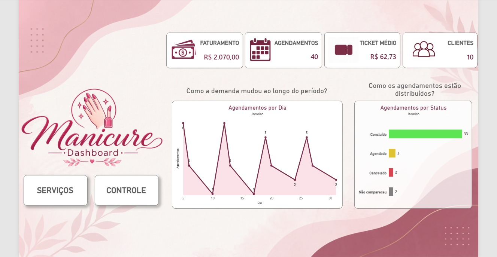
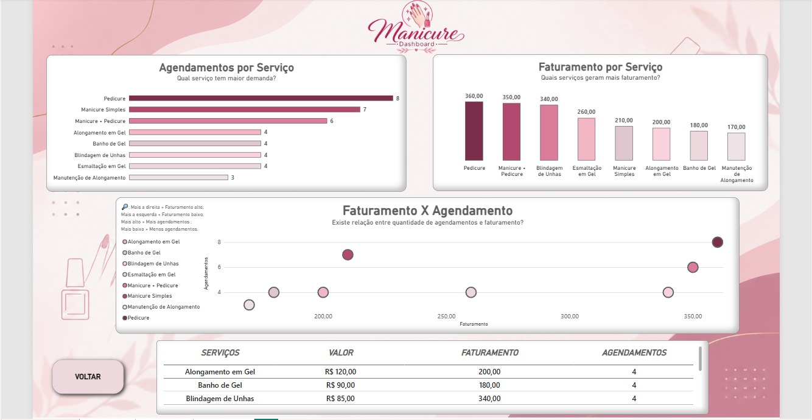
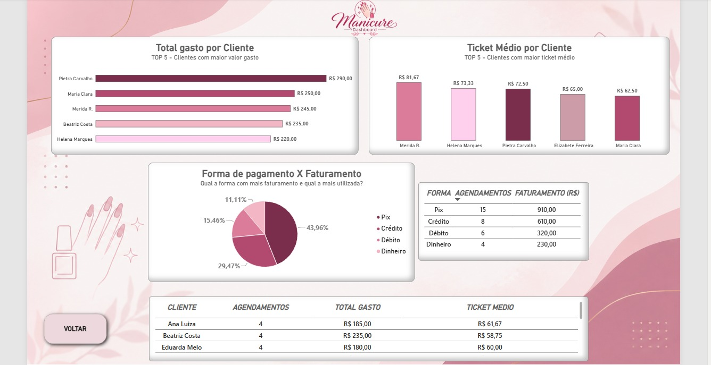

# 📅💅 Sistema de Agendamento para Manicure

Projeto de análise de dados desenvolvido para simular o gerenciamento de uma manicure autônoma, utilizando **MySQL** para estruturação e tratamento dos dados e **Power BI** para criação de indicadores e visualizações voltadas à análise do negócio.

O projeto contempla desde a **modelagem do banco de dados relacional** até a construção de um **dashboard interativo**, permitindo analisar agendamentos, serviços, faturamento, clientes e formas de pagamento.

---

## 🎯 Objetivo

Desenvolver uma solução de dados capaz de organizar informações de uma manicure autônoma e transformá-las em informações úteis para análise e tomada de decisão.

Durante o desenvolvimento foram aplicados conceitos de:

- Modelagem de banco de dados relacional
- SQL e consultas analíticas
- Relacionamentos entre tabelas
- Integridade referencial
- Funções de agregação
- JOINs
- CASE
- Subconsultas
- EXISTS
- Views
- Medidas DAX
- Visualização de dados
- Análise de indicadores de negócio

---

## 🗄️ Modelo do Banco

### Diagrama Entidade-Relacionamento


O banco de dados foi estruturado de forma relacional, utilizando quatro tabelas principais:

| Tabela | Descrição |
|---|---|
| `tb_clientes` | Cadastro dos clientes |
| `tb_servicos` | Serviços oferecidos |
| `tb_agendamentos` | Controle dos agendamentos |
| `tb_pagamentos` | Registro dos pagamentos |

---

## 🛠️ Tecnologias

- **MySQL**
- **MySQL Workbench**
- **Power BI Desktop**
- **DAX**
- **Git**
- **GitHub**

---

# 📊 Desenvolvimento da Solução

O projeto foi desenvolvido em etapas, desde a criação da estrutura do banco até a construção do dashboard.

### 1️⃣ Modelagem do Banco

Criação das tabelas, definição de chaves primárias e estrangeiras e estabelecimento dos relacionamentos entre clientes, serviços, agendamentos e pagamentos.

### 2️⃣ Inserção e organização dos dados

População das tabelas com dados fictícios para simulação de um cenário real de negócio.

### 3️⃣ Consultas SQL

Foram desenvolvidas consultas utilizando diferentes recursos do SQL para exploração e análise dos dados, incluindo:

- `SELECT`
- `WHERE`
- `ORDER BY`
- `GROUP BY`
- `HAVING`
- `INNER JOIN`
- `LEFT JOIN`
- `CASE`
- `IN`
- `EXISTS`
- Subconsultas
- `COUNT`
- `SUM`
- `AVG`
- `MAX`
- `MIN`

### 4️⃣ Criação de Views

Foram criadas views específicas para organizar os dados que seriam utilizados posteriormente no Power BI:

- `vw_geral`
- `vw_servicos`
- `vw_clientes`
- `vw_agenda`

As views permitiram estruturar informações de agendamentos, serviços, clientes, faturamento e status para facilitar a análise no dashboard.

### 5️⃣ Dashboard no Power BI

Os dados foram conectados ao Power BI e utilizados na construção de um dashboard dividido em três páginas, organizadas de acordo com diferentes perspectivas do negócio.

---

# 📈 Dashboard

## 🏠 Geral

### Perguntas de negócio

- Como está o desempenho geral do negócio?
- Como a demanda mudou ao longo do período?
- Como os agendamentos estão distribuídos entre os diferentes status?

### Principais indicadores

- **Faturamento**
- **Total de Agendamentos**
- **Ticket Médio**
- **Clientes**

### Visualizações

- Evolução dos agendamentos por dia
- Distribuição dos agendamentos por status
- Indicadores gerais do negócio



---

## 💅 Serviços

### Perguntas de negócio

- Quais serviços são mais procurados?
- Quais serviços geram mais faturamento?
- O serviço mais procurado também é o que gera mais receita?
- Existe relação entre quantidade de agendamentos e faturamento?

### Visualizações

- Agendamentos por serviço
- Faturamento por serviço
- Relação entre faturamento e quantidade de agendamentos
- Tabela de detalhamento dos serviços



---

## 👥 Controle

### Perguntas de negócio

- Quais clientes concentram maior valor gasto?
- Quais clientes apresentam maior ticket médio?
- Qual forma de pagamento é mais utilizada?
- Qual forma de pagamento concentra maior faturamento?

### Visualizações

- Top 5 clientes por total gasto
- Top 5 clientes por ticket médio
- Faturamento por forma de pagamento
- Tabela de detalhamento dos clientes



---

# 📐 Indicadores e Medidas

Foram criadas medidas no Power BI utilizando **DAX** para gerar os principais indicadores do dashboard.

### Faturamento

Indicador utilizado para acompanhar o valor total recebido.

### Ticket Médio

Indicador utilizado para analisar o valor médio dos pagamentos.

### Total de Agendamentos

Indicador utilizado para acompanhar o volume total de agendamentos.

---

# 🔎 Análises de Negócio

A construção do dashboard permitiu transformar os dados operacionais em informações para análise.

Entre os pontos analisados estão:

- Serviços com maior volume de agendamentos;
- Serviços com maior faturamento;
- Relação entre demanda e geração de receita;
- Clientes com maior valor gasto;
- Clientes com maior ticket médio;
- Distribuição das formas de pagamento;
- Distribuição dos agendamentos por status;
- Evolução da quantidade de agendamentos ao longo do período.

---

# 📋 Estrutura do Projeto

```
sistema-agendamento-manicure/
│
├── img/
│   ├── der.png
│   ├── dashboard_geral.png
│   ├── dashboard_servicos.png
│   └── dashboard_controle.png
│
├── 01_modelagem.sql
├── 02_inserts.sql
├── 03_consultas.sql
├── 04_views.sql
├── README.md
└── Dash Manicure.pbix
````
🚀 Como executar
Banco de dados (MySQL)
-- Abrir o MySQL Workbench.
-- Executar 01_modelagem.sql.
-- Executar 02_inserts.sql.
-- Executar 03_consultas.sql.
-- Executar 04_views.sql.


Power BI
-- Abrir o arquivo do projeto no Power BI Desktop.
-- Conectar ao banco de dados MySQL.
-- Atualizar os dados.
-- Explorar as páginas do dashboard.


📚 Conceitos Aplicados
Banco de Dados e SQL

✔ Modelagem Relacional
✔ Chaves Primárias e Estrangeiras
✔ Integridade Referencial
✔ Consultas SQL
✔ Funções de Agregação
✔ Filtros
✔ JOINs
✔ CASE
✔ Subconsultas
✔ EXISTS
✔ Views
✔ Consultas voltadas a cenários de negócio

Power BI e Análise de Dados

✔ Conexão com banco de dados MySQL
✔ Tratamento e organização dos dados
✔ Criação de medidas DAX
✔ KPIs
✔ Visualização de dados
✔ Construção de dashboard
✔ Análise de indicadores
✔ Perguntas de negócio
✔ Interpretação de dados

🎯 Resultado

O projeto resultou em uma solução de dados que integra banco de dados relacional, SQL e Business Intelligence, permitindo transformar dados operacionais de uma manicure autônoma em indicadores e visualizações para análise do negócio.

O desenvolvimento também proporcionou a aplicação prática de conceitos de Banco de Dados, SQL, Power BI e análise de dados, consolidando conhecimentos utilizados na construção de projetos para portfólio.

👨‍💻 Autor

Caio Oliveira Diniz

linkedin.com/in/caioodiniz
github.com/CaioDNZ
